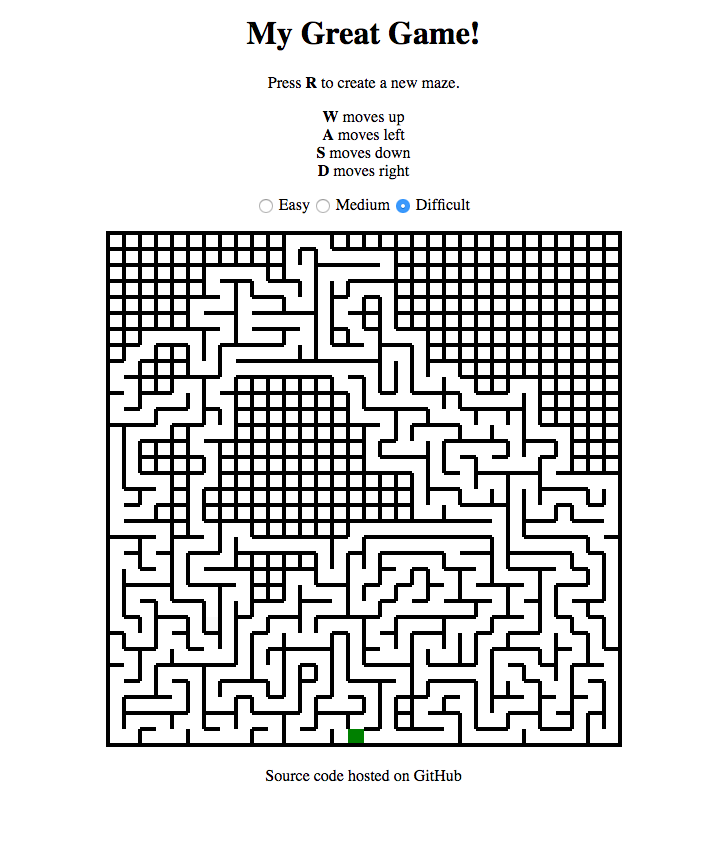

# A-Maze-ing Race

A live version is available [here](https://chris-wdi-assignments.github.io/a-maze-ing-race).

### User Story

1. Game preferences are determined, either by default or user interaction.
2. User clicks "Start Game" button. Maze is procedurally generated according to preferences. Maze is a rectangular grid of both open cells and walls. Maze has start and end points.
3. A timer is started, counting down time limit from preferences. When the timer reaches 0, the game is over.
4. User presses the W, A, S, and D keys to move their avatar. If the cell in the desired direction is a wall, nothing happens. Else, avatar moves one cell over.
5. Each time user successfully moves avatar, the game checks if the user has reached the maze endpoint. If they have reached the endpoint, they win. Else, return to step 3.
Add Comment Collapse

### Reference

I would not have been able to write the maze generation algorithm without
[this excellent article by David Stromberg](http://dstromberg.com/2013/07/tutorial-random-maze-generation-algorithm-in-javascript/).
His implementation utilizes a depth-first search algorithm, meaning every
maze has a solution and there are no loops (i.e. any point in the maze is
reachable from any other point).

Though the algorithm is based on his code, the implementation is my own:

1. The maze is made up of a rectangular grid of nodes.
2. Each node is bound to a `td` element on a `table` element.
3. Each node is linked to four adjacent nodes (above, below, to the left and right) other than edge cases (which are linked to three nodes) and corners (linked to two other nodes).
4. Walls are drawn on the browser with `td` borders.
5. Maze generation is done through node traversal in a recursive function. A delay is applied between successive calls of the function to provide an animation of the maze generation process.
